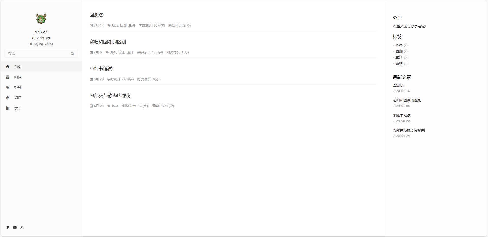

# pure-lite

a [hexo](https://hexo.io/) theme based on  [[hexo-theme-lite](https://github.com/cofess/hexo-theme-pure)].

you can see [click](https://www.yzlzzz.xyz/) here to see appearance



## Features

- No donation
- Closed comments
- Fix some bugs
- Tags page
- support rss
- multiply language

## Usage

Execute the following command under your `hexo` folder.

```
git clone https://github.com/yzlzzz/hexo-theme-pure-lite.git themes/pure-lite
```
Then modify the property `theme` of the file `hexo/_config.yml`  to `theme: pure-lite`

## Update theme

Execute the following command to update theme.

```
cd themes/pure-lite
git pull
```
## Install plugin

### [hexo-wordcount](https://github.com/willin/hexo-wordcount)

```
npm install hexo-wordcount --save
```
### [hexo-generator-json-content](https://github.com/alexbruno/hexo-generator-json-content)

```
npm install hexo-generator-json-content --save
```
### [hexo-generator-feed](https://github.com/hexojs/hexo-generator-feed)

```
npm install hexo-generator-feed --save
```
### [hexo-generator-sitemap](https://github.com/hexojs/hexo-generator-sitemap)

```
npm install hexo-generator-sitemap --save
```
### [hexo-generator-baidu-sitemap](https://github.com/coneycode/hexo-generator-baidu-sitemap)

```
npm install hexo-generator-baidu-sitemap --save
```

## Mathjax Support

### [hexo-renderer-markdown-it-plus](https://github.com/CHENXCHEN/hexo-renderer-markdown-it-plus)

### install

```
npm un hexo-renderer-marked --save
npm i hexo-renderer-markdown-it-plus --save
```

You can configure this plugin in `_config.yml`.

```
markdown_it_plus:
  highlight: true
  html: true
  xhtmlOut: true
  breaks: true
  langPrefix:
  linkify: true
  typographer:
  quotes: “”‘’
  plugins:
    - plugin:
        name: markdown-it-katex
        enable: true
    - plugin:
        name: markdown-it-mark
        enable: false  
```

Article enable mathjax

```
title: Hello World
mathjax: true
```

